# How a Website Project Evolved Into My First SOC Home Lab

> What started as a simple website became a platform for learning networking, threat detection, incident response, and security operations.

**Journey at a glance:** Website → Azure home lab → Custom telemetry → Analytics rules → Incidents → Workbooks → SOAR exploration

---

## Why I Started This Project

When I started this project, I thought I was simply building a website.

As part of our training, we were tasked to create and host a web application to help us understand concepts such as DNS, FQDNs, Apache web servers, Linux administration, and networking fundamentals.

What I did not realize at the time was that this simple requirement would eventually lead me to build my first SOC home lab and completely change how I understood cybersecurity.

---

## The Idea

Instead of creating a generic website, I designed a phishing-awareness simulation around a company assessing employee awareness of phishing and social engineering risks.

Users would:

- Visit a mock Security Training & Compliance Portal
- Submit registration details
- Download a simulated training resource
- Receive a harmless awareness message about opening untrusted files

The downloadable file was not malware. It was a harmless batch-file simulation created solely for awareness and learning inside the lab.

<p align="center">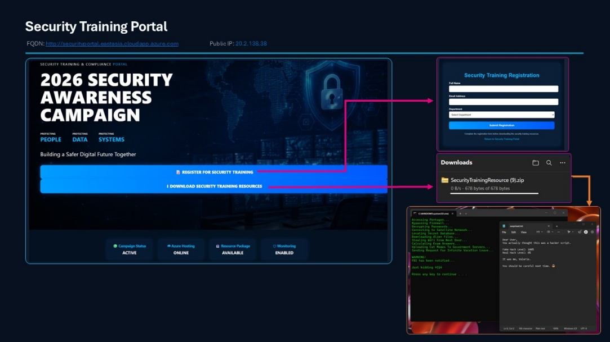</p>
<p align="center"><em>Figure 1. Security Training & Compliance Portal and simulated awareness workflow.</em></p>

---

## Building My Home Lab

As the website developed, I began asking bigger questions:

- How does DNS resolve the website?
- How does an FQDN point users to the server?
- Where are web requests recorded?
- Can the activity be collected and monitored?
- Can suspicious behavior be detected?

Those questions expanded the project into a small Azure-based home lab with two virtual machines:

### WEB01

- Hosted the Security Training & Compliance Portal
- Hosted the simulated Administration Portal
- Ran Ubuntu Linux, Apache, and PHP
- Generated web and authentication telemetry

### ATTACK01

- Generated controlled website activity
- Simulated reconnaissance and directory scanning
- Simulated repeated failed login attempts

<p align="center">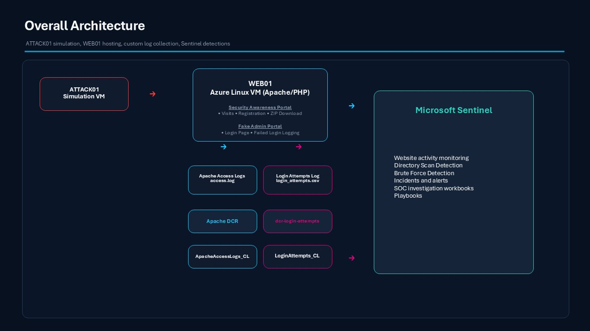</p>
<p align="center"><em>Figure 2. Azure home-lab architecture showing ATTACK01, WEB01, custom telemetry, and Microsoft Sentinel.</em></p>

---

## Tools That Helped Me Learn

- Microsoft Azure and Azure Virtual Machines
- Ubuntu Linux, Apache, PHP, HTML, and CSS
- Microsoft Sentinel and Microsoft Defender
- Log Analytics Workspace, Data Collection Rules, and KQL
- Microsoft Sentinel workbooks and Azure Logic Apps

The value was not simply learning each tool. It was understanding how the tools worked together across the security lifecycle.

---

## Turning Activity Into Telemetry

Every portal visit, registration, download, reconnaissance request, and login attempt generated data. I collected that activity through two custom telemetry paths.

### Website Activity

```text
Security Training Portal
        ↓
Apache access logs
        ↓
Data Collection Rule
        ↓
ApacheAccessLogs_CL
```

Captured activity included:

- Website visits and registration activity
- Training-resource downloads
- Reconnaissance and directory-scanning attempts

<p align="center">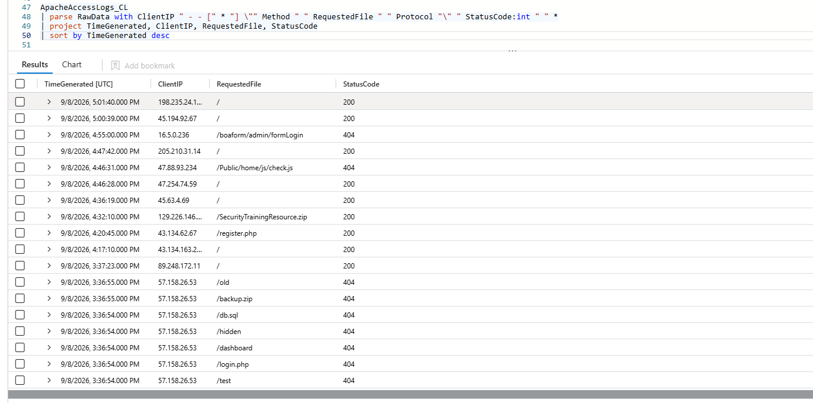</p>
<p align="center"><em>Figure 3. Legitimate and suspicious website requests parsed from ApacheAccessLogs_CL.</em></p>

### Authentication Activity

To expand the project beyond website monitoring, I created a simulated Administration Portal as a controlled authentication target. The portal did not authenticate users or store submitted passwords. Each submission generated a simulated failed-authentication event, while only the timestamp, source IP, attempted username, result, and user agent were recorded.

<p align="center">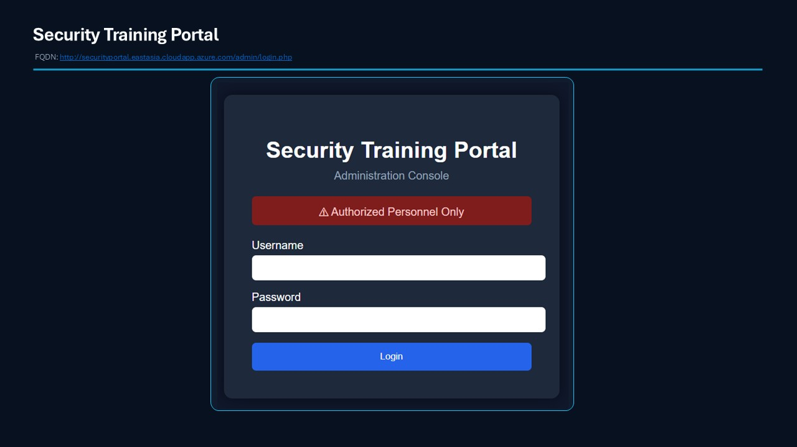</p>
<p align="center"><em>Figure 4. Simulated Administration Portal used for controlled authentication testing.</em></p>

```text
Administration Portal
        ↓
login_attempts.csv
        ↓
Data Collection Rule
        ↓
LoginAttempts_CL
```

<p align="center">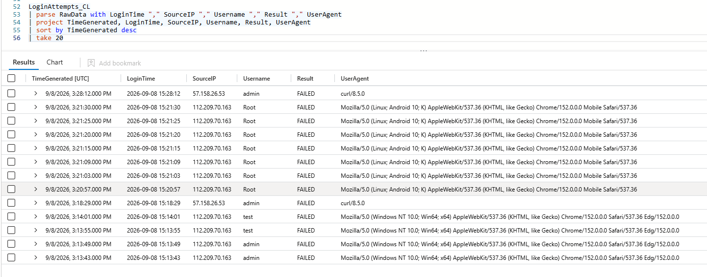</p>
<p align="center"><em>Figure 5. Failed-authentication telemetry parsed from LoginAttempts_CL.</em></p>

Once both telemetry sources were available, the next question became clear: **Could I turn these logs into meaningful security detections?**

---

## Building Security Detections

Using Microsoft Sentinel analytics rules, I created detections for normal portal activity and controlled attack simulations.

### User Activity Monitoring

- Security Awareness Portal Access Detected
- Registration Submission Detected
- Security Training Package Download Detected

### ATTACK01 Activity Monitoring

- ATTACK01 Web Request Detected
- ATTACK01 Repeated Web Activity
- ATTACK01 Excessive Web Activity

### Threat Detections

- Directory Scanning Detected
- Brute Force Login Attempts Detected

<p align="center">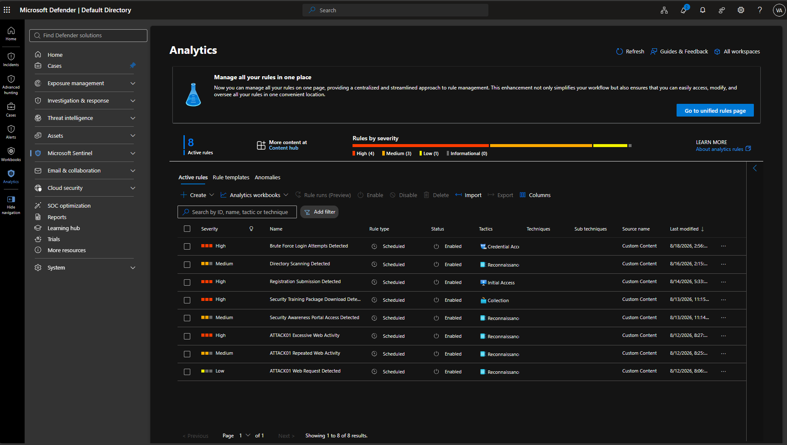</p>
<p align="center"><em>Figure 6. Custom analytics rules covering portal activity and attack simulations.</em></p>

### Directory Scanning Detected

ATTACK01 requested common paths such as `/.env`, `/.git`, `/phpmyadmin`, `/wp-admin`, `/config.php`, and `/backup.zip`. The rule looked for repeated HTTP 404 responses to suspicious paths from the same source.

<p align="center">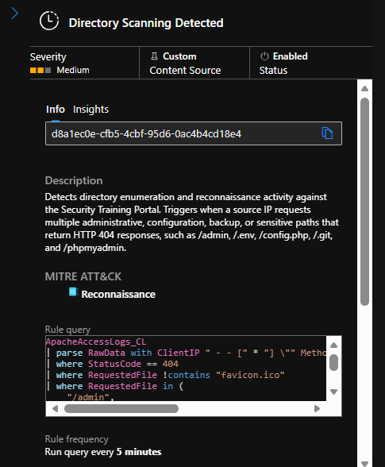</p>

### Brute Force Login Attempts Detected

ATTACK01 generated repeated failed logins against the simulated Administration Portal. The rule identified five or more failed attempts from the same source IP within a five-minute window.

<p align="center">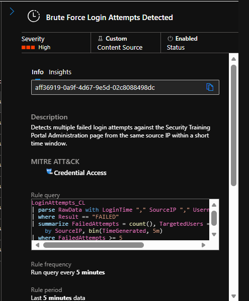</p>

```text
Simulated Attack
        ↓
Logs
        ↓
Custom Tables
        ↓
Analytics Rules
        ↓
Alerts
        ↓
Incidents
```

---

## From Alerts to Investigation

Once the rules triggered, Microsoft Sentinel and Microsoft Defender allowed me to move beyond raw logs and investigate the resulting security events.

During investigation, I could:

- Review the incident title, timing, severity, and triggering analytics rule
- Inspect the source IP and related telemetry
- Correlate web activity with authentication activity
- Follow the activity from alert generation to incident investigation

<p align="center">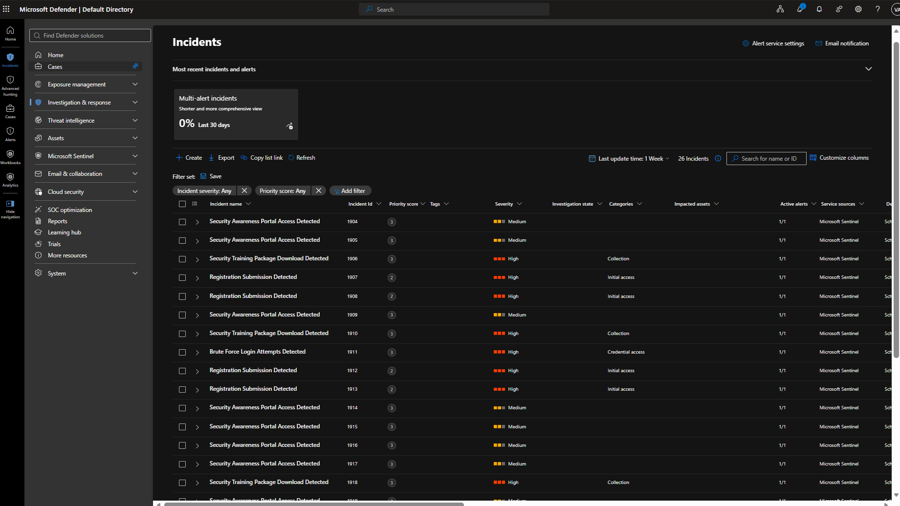</p>
<p align="center"><em>Figure 7. Incident queue in Microsoft Defender.</em></p>

<p align="center">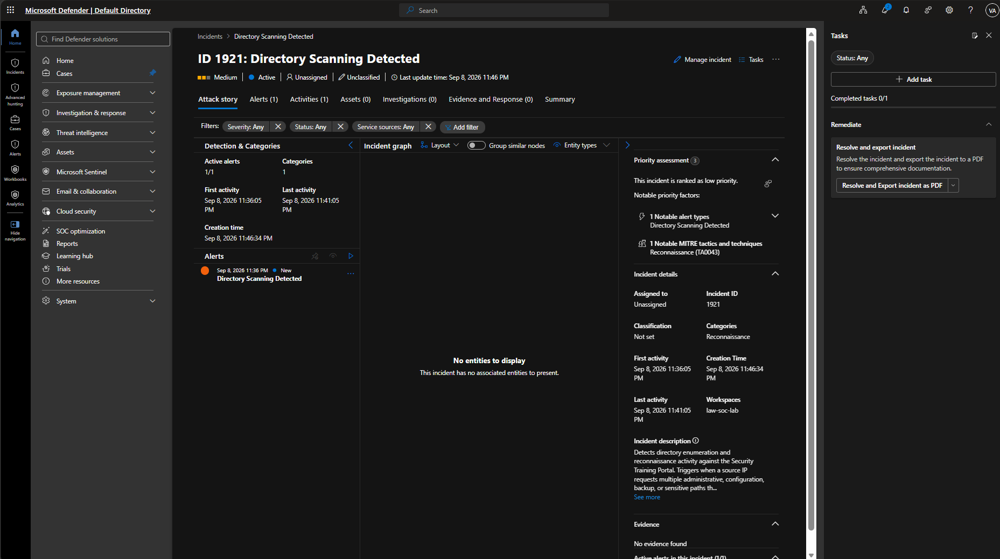</p>
<p align="center"><em>Figure 8. Directory Scanning Detected incident investigation view.</em></p>

<p align="center">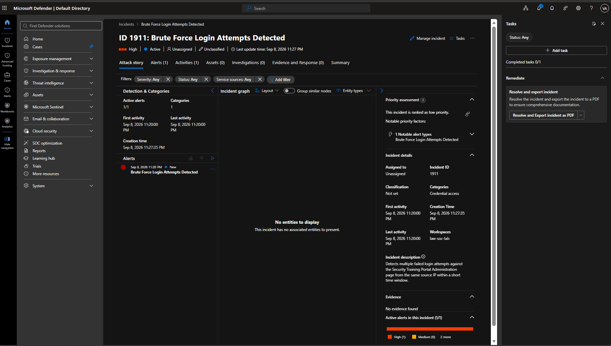</p>
<p align="center"><em>Figure 9. Brute Force Login Attempts Detected incident investigation view.</em></p>

For the first time, I was investigating incidents generated from activity that I had created, collected, and detected inside an environment I built myself.

---

## Visualizing the Environment

I created two custom Microsoft Sentinel workbooks to answer two practical questions: **What is happening on the website, and what is happening during authentication?**

### Security Awareness Monitoring Dashboard

- Website traffic and user activity
- Registrations and downloads
- Requested paths and traffic trends

<p align="center">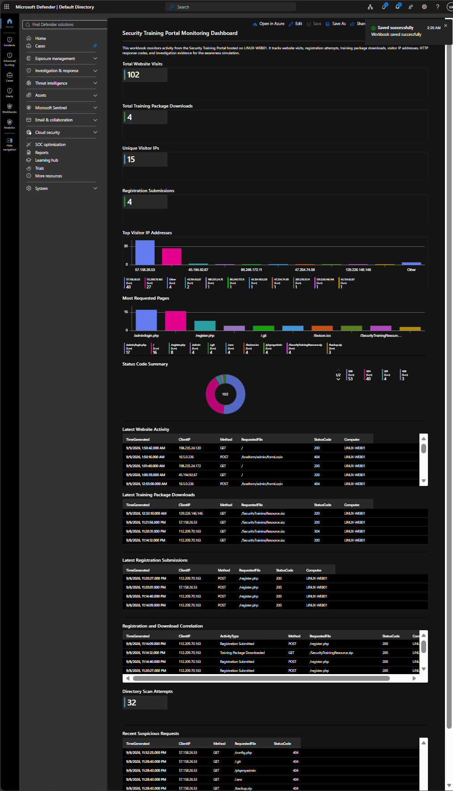</p>

### Authentication Threat Monitoring Dashboard

- Failed login attempts
- Source IPs and targeted usernames
- Authentication trends and brute-force detections

<p align="center">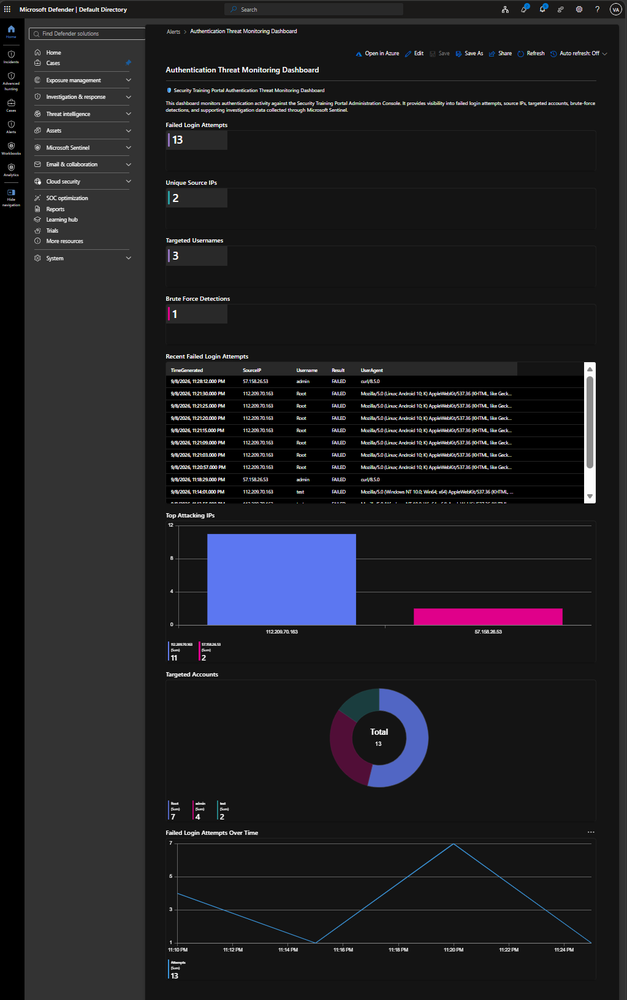</p>

The workbooks helped transform large volumes of telemetry into information that could be understood and investigated more quickly.

---

## Exploring Security Automation

After learning detection and investigation, I wanted to explore Security Orchestration, Automation, and Response. I created an Azure Logic Apps playbook named `PB-BruteForce-AddIncidentComment`.

```text
Microsoft Sentinel Incident
        ↓
Add Comment to Incident
```

The workflow was designed to add a standardized investigation checklist to brute-force incidents, including guidance to review `LoginAttempts_CL`, the source IP, targeted usernames, and the authentication workbook.

> Add the Logic App Designer screenshot here later if you want to show the incident-trigger and comment action visually.

This was a simple first step into SOAR, but it helped me understand how automation can support a more consistent investigation process.

---

## The Challenges Along the Way

Most of the learning happened when something did not work immediately.

- Networking concepts felt disconnected until I had to make the website reachable through DNS, an FQDN, and a public IP.
- Custom logs became meaningful only after I followed the path from the source file to the DCR, custom table, and KQL query.
- When an alert did not trigger immediately, I learned to validate each layer: activity, logs, ingestion, detection logic, alert, and incident.

Every problem forced me to ask another question, and every question taught me something new.

---

## Advice to Other Learners

> **Build something.**

It does not have to be perfect, enterprise-grade, or complicated. Build something that gives you room to ask questions.

Every time I asked, **“How does this work?”**, I ended up learning a new technology, troubleshooting a new problem, or discovering a new security concept.

Some of my biggest lessons did not come from completing the project. They came from figuring out why something was not working.

---

## Final Thoughts

Looking back, this became one of the most memorable projects of my training journey.

I thought I was learning web hosting. Instead, I learned networking, Linux administration, telemetry collection, threat detection, incident investigation, dashboard creation, and security automation.

What started as a website became the foundation of my first SOC home lab. Somewhere between a phishing-awareness simulation, a Sentinel alert, a Defender investigation, and a security incident, I realized I was no longer just studying cybersecurity.

> **I was practicing it.**

---

## Author

**Valerie A. Alejandro**  
Security Managed Services Associate | SOC Analyst

## Disclaimer

This repository documents a controlled educational lab. All attack simulations were performed only against systems owned and configured for the project. The simulated awareness file was harmless and did not contain malware or collect passwords.

## License

This project is licensed under the MIT License. See [LICENSE](LICENSE) for details.
